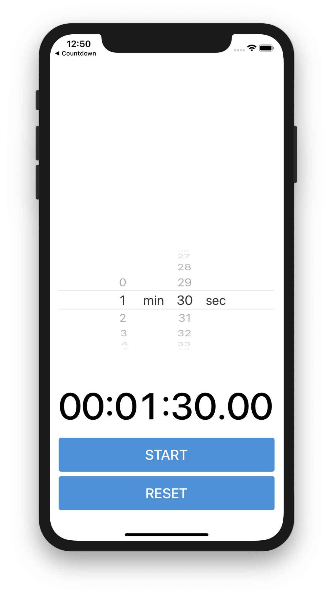

# Alert Controllers, Pickers, and Timers Guided Project

## Starter Project

Have students fork and clone the [starter guided project](https://github.com/LambdaSchool/ios-guided-project-starter-alert-controllers-pickers-timers).



## Demo

1. Demo the countdown app

## Storyboard Tasks

1. Design the UI using stack view (see storyboard of finished project for details) 
2. Wire up outlets for the UI components in `CountdownViewController`
3. Wire up actions for "START" and "RESET" buttons

## Initial View Controller Tasks

4. Implement `showAlert()` - explain how alert controllers work and the various configuration options; mention the use of closures for action button handlers, but don't go in-depth; closures will be covered in the networking sprint
    ```swift
	private func showAlert() {
        let alert = UIAlertController(title: "Timer Finished!", message: "Your countdown is over.", preferredStyle: .alert)
	    
        alert.addAction(UIAlertAction(title: "Ok", style: .default, handler: nil))
        self.present(alert, animated: true)
    }
    ```
5. Show the alert when `startButtonTapped()`
	```swift
	@IBAction func startButtonTapped(_ sender: UIButton) {
	    showAlert()
	}
	```

## Run and Test

6. Run the app and test the layout from the storyboard as well as the alert controller you just added to the start button `IBAction`.
7. Ask the students to raise their hands in Zoom if their apps work as designed

## Timer Tasks

8. Show `Timer` documentation and explain how we can call a method after 2 seconds using the `Timer.scheduledTimer(withTimeInterval: repeats: block:)` method
9. Implement the method `timerFinished(timer:)` to show the alert after 2 seconds using a `Timer` object
    ```swift
        @IBAction func startButtonTapped(_ sender: UIButton) {
            let timer = Timer.scheduledTimer(withTimeInterval: 2, repeats: false, block: timerFinished(timer:))
        }
    
        private func timerFinished(timer: Timer) {
            showAlert()
        }
    ```
10. Run the app and test this functionality. Show how the label doesn't update because we haven't coded it to do so. Talk about how users want visual feedback when a timer is running.
11. Use the included `Countdown` class to keep track of time remaining (business logic).
	* Discuss how the "Countdown.swift" works from a high level
	* It manages a timer, and clears the timer when finished
	* It does date math to figure out how much time is remaining
	* It can be reset
12. Remove or comment out the above code in the IBAction that schedules a timer, and the method that runs when the timer fires. We'll be using the `Countdown` class instead to track the timer.
13. Declare a `Countdown` property in the view controller:
    ```swift		    
    private let countdown = Countdown()
    ```
14. Set the duration in `viewDidLoad()`
    ```swift
    override func viewDidLoad() {
        super.viewDidLoad()

        countdown.duration = 5
    }
    ```
15. Start the countdown in `startButtonTapped()`
    ```swift
    @IBAction func startButtonPressed(_ sender: Any) {
        countdown.start()
    }
    ```

### Conform to the `CountdownDelegate`

16. Set the delegate
    ```swift
    override func viewDidLoad() {
        super.viewDidLoad()

        countdown.duration = 5
        countdown.delegate = self
    }
    ```
17. Conform to the protocol (the conformance is already in the starter project with stubbed out methods)
    ```swift
    extension CountdownViewController: CountdownDelegate {
        func countdownDidFinish() {
            showAlert()
        }
			    
        func countdownDidUpdate(timeRemaining: TimeInterval) {

        }
    }
    ```
18. Implement the `updateViews()` method to update the label with the current time.
	```swift
    private func updateViews() {
        timeLabel.text = String(countdown.timeRemaining)
    }
    ```
19. Call `updateViews()` from delegate methods:
    ```swift
    extension CountdownViewController: CountdownDelegate {
        func countdownDidFinish() {
            updateViews()
            showAlert()
        }

        func countdownDidUpdate(timeRemaining: TimeInterval) {
            updateViews()
        }
    }
	```

## Run and Test

20. The UI needs to be updated; it's not user friendly, and the font resizes in `CountdownViewController`

## UI Fixes

21. Update display label with a monospaced font so it doesn't jump around; call `updateViews()` immediately
	```swift
    override func viewDidLoad() {
        super.viewDidLoad()

        countdown.duration = 5
        countdown.delegate = self

        // Use a fixed width font, so numbers don't "pop" and update UI to show duration
        timeLabel.font = UIFont.monospacedDigitSystemFont(ofSize: timeLabel.font.pointSize, weight: .medium)
        updateViews()
    }
	```

22. Create a date formatter to turn time remaining into a properly formatted string (Add in the Properties section)
	```swift
    var dateFormatter: DateFormatter = {
        let formatter = DateFormatter()
        formatter.dateFormat = "HH:mm:ss.SS"
        formatter.timeZone = TimeZone.init(secondsFromGMT: 0)
        return formatter
    }()
    ```
23. Use the date formatter in the `string(from:) method
    ```swift
    func string(from duration: TimeInterval) -> String {
        let date = Date(timeIntervalSinceReferenceDate: duration)
        return dateFormatter.string(from: date)
    }
	```
24. Update the `updateViews()` method to use the new formatter code to give text: `00:00:00.00` format
    ```swift
    private func updateViews() {
        timeLabel.text = string(from: countdown.timeRemaining)
    }
    ```

## Run and Test

25. Run the app and test that the timer runs and displays the countdown with the correct formatting (hard coded to be 5 seconds right now as picker view hasn't been configured yet).
27. Ask the students to raise their hands in Zoom if their apps work as designed

## OPTIONAL: Timer Updates

28. QUESTION: What happens to the UI if we change "Countdown.swift" to use 1 second for the interval?
    ```swift
    func start() {
        ...
        timer = Timer.scheduledTimer(withTimeInterval: 1.0, repeats: true, block: updateTimer(timer:))
        ...
    }
    ```
## Resetting the Countdown

29. Implement the reset button action
    ```swift
    @IBAction func resetButtonPressed(_ sender: Any) {
        countdown.reset()
    }
    ```

## UIPickerView for Minutes and Seconds selection

30. Set the datasource and delegate for the picker view to the view controller
    ```swift
    override func viewDidLoad() {
        super.viewDidLoad()

        countdown.duration = 5
        countdown.delegate = self

        countdownPicker.dataSource = self
        countdownPicker.delegate = self

        // Use a fixed width font, so numbers don't "pop" and update UI to show duration
        timeLabel.font = UIFont.monospacedDigitSystemFont(ofSize: timeLabel.font.pointSize, weight: .medium)
        updateViews()
    }
	``` 
31. Implement the datasource methods in the extension of the view controller. Explain what each of these methods do and compare them to their similar methods in a tableview's datasource.
    ```swift
    extension CountdownPicker: UIPickerViewDataSource {
        func numberOfComponents(in pickerView: UIPickerView) -> Int {
            return 1
        }
 
        func pickerView(_ pickerView: UIPickerView, numberOfRowsInComponent component: Int) -> Int {
            return 5
        }
    }
    ```
32. Implement the delegate method `pickerView(_:titleForRow:forComponent:)`. Explain it's function and how it compares to the similar method in a tableview.
    ```swift
    extension CountdownPicker: UIPickerViewDelegate {
        func pickerView(_ pickerView: UIPickerView, titleForRow row: Int, forComponent component: Int) -> String? {
            return "Minute"
        }
    }
    ```

## Run and Test

33. Build and run the app.
34. RAISE YOUR HAND if you see "Minute" repeat 5 times in the picker.

## Setup UIPickerView Data

35. We need to provide data in 4 columns:
    * minutes
    * A minute label
    * seconds
    * A second label

36. Explain code inside the lazy-loaded property and how it creates the data we need in a 2-dimensional array.
    ```swift
    lazy var countdownPickerData: [[String]] = {
        // Create string arrays using numbers wrapped in string values: ["0", "1", ... "60"]
        let minutes: [String] = Array(0...60).map { String($0) }
        let seconds: [String] = Array(0...59).map { String($0) }
 
        // "min" and "sec" are the unit labels
        let data: [[String]] = [minutes, ["min"], seconds, ["sec"]]
        return data
    }()
    ```
37. Use the data in the datasource/delegate methods
    ```swift
    extension CountdownPicker: UIPickerViewDataSource {
        func numberOfComponents(in pickerView: UIPickerView) -> Int {
            return countdownPickerData.count
        }

        func pickerView(_ pickerView: UIPickerView, numberOfRowsInComponent component: Int) -> Int {
            return countdownPickerData[component].count
        }
    }

    extension CountdownPicker: UIPickerViewDelegate {
        func pickerView(_ pickerView: UIPickerView, titleForRow row: Int, forComponent component: Int) -> String? {
            let timeValue = countdownPickerData[component][row]
            return String(timeValue)
        }
    }
    ```

## Customize the UIPickerView and Respond to Input

38. Make the width 50, and implement method to know what row was selected.
    ```swift
    extension CountdownPicker: UIPickerViewDelegate {
        func pickerView(_ pickerView: UIPickerView, titleForRow row: Int, forComponent component: Int) -> String? {
            let timeValue = countdownPickerData[component][row]
            return String(timeValue)
        }

        func pickerView(_ pickerView: UIPickerView, widthForComponent component: Int) -> CGFloat {
            return 50
        }

        func pickerView(_ pickerView: UIPickerView, didSelectRow row: Int, inComponent component: Int) {
            // Update UI
        }
    }
    ```
39. Create a computed property to calculate the duration of the picker (place in Properties section)
    ```swift
    private var duration: TimeInterval {
        // Convert from minutes + seconds to total seconds
        let minuteString = countdownPicker.selectedRow(inComponent: 0)
        let secondString = countdownPicker.selectedRow(inComponent: 2)
        
        let minutes = Int(minuteString)
        let seconds = Int(secondString)
        
        let totalSeconds = TimeInterval(minutes * 60 + seconds)
        return totalSeconds
    }
    ```
40. Implement logic in the `pickerView(_:didSelectRow:inComponent:)` method to update the UI with the current duration
    ```swift
    extension CountdownPicker: UIPickerViewDelegate {
        func pickerView(_ pickerView: UIPickerView, titleForRow row: Int, forComponent component: Int) -> String? {
            let timeValue = countdownPickerData[component][row]
            return String(timeValue)
        }

        func pickerView(_ pickerView: UIPickerView, widthForComponent component: Int) -> CGFloat {
            return 50
        }

        func pickerView(_ pickerView: UIPickerView, didSelectRow row: Int, inComponent component: Int) {
            countdown.duration = duration
            updateViews()
        }
    }
    ```
41. Update the countdown duration to use the `countdownPicker.duration`
    ```swift
    override func viewDidLoad() {
        super.viewDidLoad()

        countdown.duration = duration
        countdown.delegate = self

        countdownPicker.dataSource = self
        countdownPicker.delegate = self

        // Use a fixed width font, so numbers don't "pop" and update UI to show duration
        timeLabel.font = UIFont.monospacedDigitSystemFont(ofSize: timeLabel.font.pointSize, weight: .medium)
        updateViews()
    }
	``` 
42. Update the `updateViews()` method to show the current duration based on state.
    ```swift
    private func updateViews() {
        startButton.isEnabled = true
        
        switch countdown.state {
        case .started:
            timeLabel.text = string(from: countdown.timeRemaining)
            startButton.isEnabled = false
        case .finished:
            timeLabel.text = string(from: 0)
        case .reset:
            timeLabel.text = string(from: countdown.duration)
        }
    }
    ```
43. Set a starting value for the countdownPicker
    ```swift
    override func viewDidLoad() {
        super.viewDidLoad()

        countdown.duration = duration
        countdown.delegate = self

        // Set default duration to 1 minute 30 seconds
        countdownPicker.selectRow(1, inComponent: 0, animated: false)
        countdownPicker.selectRow(30, inComponent: 2, animated: false)

        countdownPicker.dataSource = self
        countdownPicker.delegate = self

        // Use a fixed width font, so numbers don't "pop" and update UI to show duration
        timeLabel.font = UIFont.monospacedDigitSystemFont(ofSize: timeLabel.font.pointSize, weight: .medium)
        updateViews()
    }
	```

## Run and Test

44. Build and run the app. Ensure all functionality works properly. App should be feature complete.